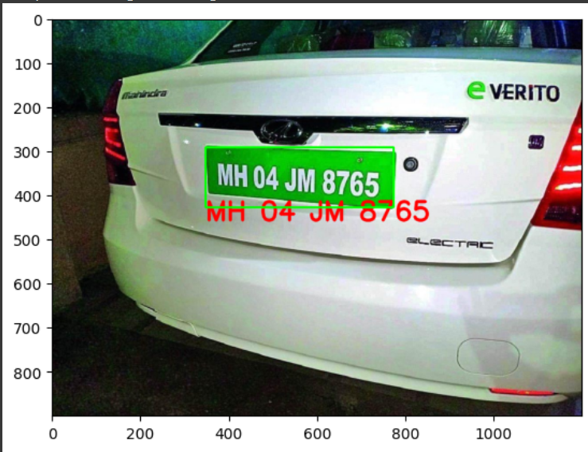

# Number Plate Detection Using EasyOCR on Google Colab

This project demonstrates number plate detection using the EasyOCR library in a Google Colab environment. It allows you to extract and recognize license plates from images or video streams.

## Table of Contents
- [Prerequisites](#prerequisites)
- [Usage on Google Colab](#usage-on-google-colab)
- [Demo](#demo)
- [Contributing](#contributing)
- [License](#license)

## Prerequisites

Before using this project on Google Colab, ensure you have a Google account, and you're familiar with using Google Colab.

## Usage on Google Colab

To run this project on Google Colab, follow these steps:

1. Open Google Colab: Go to [Google Colab](https://colab.research.google.com/).

2. Import the project notebook: Click on "File" > "Open notebook" and enter the following GitHub URL in the "GitHub" tab:

